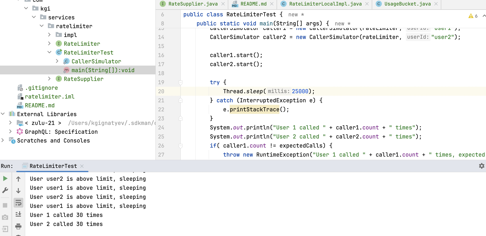

requirements
-----

XXXX offers different APIs to sellers, and we want to prevent
misuse by implementing a basic rate limiting system for one of the API endpoints. 
The objective is to limit the number of requests a seller can make to the API within a 
specific time frame.

Requirements:
Design a rate limiter that allows a user to make a maximum of N requests within a rolling time 
window of M seconds. 
The rate limiter should be able to handle a large number of users concurrently.
Ensure that the implementation is thread-safe and can be used in a multi-threaded environment.

testing
-----

To test the rate limiter run com.kgi.services.ratelimiter.RateLimiterTest

it should finish without exceptions and print something like this:

